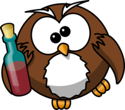
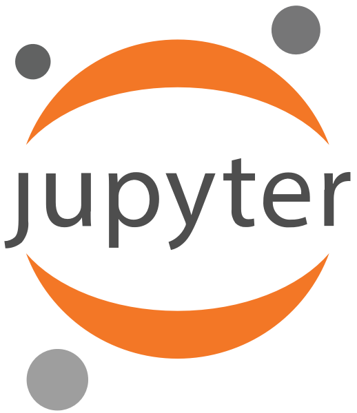

  
  # Open Source Alcohol Resources
  ## Overview
  I'm the original maintainer behind _OSS Alcohol Resources_ | Amateur wine & cider.  
  The aim of this project is to promote a variety of alcohol-focused free and open source projects and resources.
  
  Drink in moderation ! 

   
  

---
<section>

## Beer  

<em>Toggle the list</em>

+ **[The Pyrmont (Secret Squirrel) Brewery](https://github.com/beerbrewing/beerbrewing.github.io)**: Beers are brewed exclusively for local businesses to keep distribution cost minimal and stay within a resonable capacity. Based in Sydney, Australia. Project built with 
 
+ **[Ale Trail API](https://github.com/PartyLab/ale-trail-api)**: Backend API to retrieve Ale Trail data. Project built with 

+ **[NS Beer Map](https://github.com/mreid-moz/nsbeermap)**: Get together with friends and find your best craft beers in the province of Nova Scotia, Canada. Project built with  

+ **[Beer Fest DB](https://github.com/tfrayner/beerfestdb)**: BeerFestDB provides a comprehensive way to manage your beer cellar management database. Project built with  

+ **[DCJS Leaflet Untappd](https://github.com/austinlyons/dcjs-leaflet-untappd)**: Data visualization on beer drinking history and habits via the Untappd API and Leaflet library. Project built with 

+ **[homebrewR](https://github.com/davesteps/homebrewR)**: One of a kind web app that lets you compare 5 styles of beer, then returns graph data sets. Project built with 

+ **[Beer Me Up](https://github.com/benoitletondor/Beer-Me-Up)**: Beer tracking app that allows you to record every beer you have consumed. Access your history and statistics. Project built with 

+ **[drinkR](https://github.com/rasmusab/drinkr)**: Practical app to estimate your Blood Alcohol Concentration (BAC) level. Project built with 

+ **[Fab Beer](https://github.com/fab-beer/fab-beer.github.io)**: Fab is launched with a noble mission: Brewing world class beers which build a better world through art. Project built with   

+ **[dataBinch](https://github.com/Raphbub/dataBinch)**: Statistics and visualisations of a large selection of beers in Lausanne bars. Project built with 

+ **[Beerlocker](https://github.com/scottksmith95/beerlocker)**: Application where you can manage your beer collection with CRUD operations (Create, Read, Update, Delete) through a RESTful API. Project built with 

+ **[Belgian Beer Explorer [fork]](https://github.com/bluefyreio/belgian-beer-explorer)**: Beer explorer which lists 1728 Belgian beers as of 1st of Jan. 2020. Project built with  

+ **[StrangeBrew](https://github.com/DougEdey/StrangeBrew)**: Java port of Windows-based homebrewing software, StrangeBrew, now discontinued. Project built with 

+ **[CraftBeerPI](https://github.com/manuel83/craftbeerpi)**: Raspberry Pi-based brewing and fermentation controller with lot of great features. Community of 1400 brewers. Project built with   

+ **[Strangebrew Elsinore Server](https://github.com/DougEdey/SB_Elsinore_Server)**: Brewery controller that runs on Raspberry Pi. Accessible for brewers across all platforms. Project built with   

+ **[BrewPiLess](https://github.com/vitotai/BrewPiLess)**: Most advanced fermentation temperature controller. Project built with  

+ **[BrewManiacEx](https://github.com/vitotai/BrewManiacEsp8266)**: Yet another brew controller based on ESP8266 with key features of next-generation controller. Project built with  

+ **[Brewtarget](https://github.com/Brewtarget/brewtarget)**: Cross-platform brewing and beer recipe creation software. Project built with  

+ **[Tappdopolet](https://github.com/Boren/tappdopolet)**: Google Chrome extension that lets you find information about beers in Vinmonopolet (Norwegian governement-owned liquor store) filtering them by popularity (ratings) or price through Untappd API. Project built with  

+ **[Brew Day](https://github.com/chrisgilmerproj/brewday)**: Beer making tools/utilities for homebrewers. Project built with 

+ **[BrewSci](https://github.com/chrisgilmerproj/brewsci)**: When science, maths and brewing make each other better. Project built with 

+ **[Beers](https://github.com/crelies/Beers)**: Experimental app that shows a list of beers, storing data through a JSON API. Project built with 

+ **[punkapi-db](https://github.com/samjbmason/punkapi-db)**: API that fetches the beer inventory through Brewdog's DIY Dog. Project built with 

+ **[BrewCenterAPI](https://github.com/BrewCenter/BrewCenterAPI)**: API for managing homebrewing related data. Project built with 

+ **[BeerDeCoded](https://github.com/beerdecoded/Beer_ITS_analysis)**: Beer ITS analysis. Project built with  

+ **[Malt.io](https://github.com/danielgtaylor/malt.io)**: Community for brewers who like to share their recipes. Project built with 

+ **[drinkingbuddy](https://github.com/silverstone1903/drinkingbuddy)**: Locator app for craft beer drinkers who care about price and travel distance. Project built with 

+ **[Beer's Law Lab](https://github.com/phetsims/beers-law-lab/tree/master)**: Educational simulation in HTML5, by [PhET Interactive Simulations](https://phet.colorado.edu/) at the University of Colorado Boulder. Project built with 

+ **[OpenBeerMap](https://github.com/OpenBeerMap/OpenBeerMap.github.io)**: View and edit the draught beers available in bars through a map. Project built with  

+ **[Beers in the Middle](https://github.com/omonk/beersinthemiddle-v2)**: That app helps groups of friends find the perfect place to meet for drinks or food by finding the average distance between each friend. Project built with 

+ **[Beer-Tracker](https://github.com/silverstone1903/Beer-Tracker/tree/master)**: Tracking app for craft beer enthusiasts who want to chronicle a journey through the vast world of beer. Project built with 

+ **[Cheapfathers-Bubble-logger](https://github.com/kbaggen/Cheapfathers-Bubble-Logger)**: A ferment Acivity-Logger/Temperature-Controller, measuring "Temperature and Sound detection of CO2 bubbles" for NodeMCU (ESP8266). Project built with 

+ **[BeerAdvice](https://github.com/martinstork/BeerAdvice)**: API for getting advice whether to drink beer or Jägertee. Project built with 

+ **[Juleol](https://github.com/umglurf/juleol)**: Web app to aid with the rating of Christmas beer and other beers in Norway. Project built with 

+ **[Beer App](https://github.com/arichard-info/Beer-App)**: Beer consumption monitoring application with the purpose to provide consumption statistics to the user. Project built with 

+ **[What To Brew](https://github.com/maquintal/WhatToBrew)**: Web app for beer brewing recipe. Project built with 

+ **[Beer Reviews](https://github.com/hjsuh18/beer_reviews)**: Aspect based sentiment analysis to predict beer ratings based on review text. Project built with 

+ **[Brew journal](https://github.com/wnuczek/brew-journal)**: Web app showing brewed beers details in polish language. Project built with 

+ **[Beer Time](https://github.com/Geomint/beer-time)**: Website for the craft beer lovers. Made in UK. Project built with  

+ **[Crafted in Sweden](https://github.com/vogelsara/crafted-in-sweden)**: Meeting place for craft beer lovers and breweries. Part of a student project. Project built with  

+ **[Beer Tracker](https://github.com/carrieschmid/BeerTracker)**: Another beer tracker. Part of a student project. Project built with 

+ **[Github Pub](https://github.com/jefersonbrzcosta/Github-PUB)**: Where all the GitHub users meetup for a beer. Project built with  

+ **[Beer Pong](https://github.com/chad-bot/Beer-Pong)**: Controlled Highly Accurate Deadeye is a robot that plays beer pong.

+ **[Craft & Draft](https://github.com/craftanddraft/craftanddraft.github.io)**: Personal website about craft beer. Project built with   

+ **[BeerWarehouse](https://github.com/webbaard/BeerWarehouse)**: Application that track all you exotic beers. Project built with  

</section>
  

<!--cider-->
<section>
                                                    
## Cider/Champagne 

<em>Toggle the list</em>

+ **[Cidercade On-Tap Alerter](https://github.com/BenDMyers/Cidercade_OnTap_Alerter)**: Smart crawler that notify users of updates on selection of cider on-tap. Project built with 

+ **[Champagne De Blémond](https://github.com/champagnedeblemondv2/champagnedeblemondv2.github.io)**: Website for De Blémond Champagne House located in Cuis in northeastern France. Project built with   

</section>
  

<!--cocktail-->
<section>

## Cocktail 

<em>Toggle the list</em>

+ **[TheCockTailDB](https://github.com/MrHenryA/NPM-CocktailDB-API-Search)**: Database of drinks and cocktails worldwide that provides an easy API integration. Project built with 

+ **[Drinks](https://github.com/wKovacs64/drinks)**: Run your own static site to showcase your favorite cocktails. Project built with 

+ **[ESIEA-DrinkIT](https://github.com/Nashunn/ESIEA-DrinkIT)**: Browse the cocktail of your choice and made your own recipe. Project built with 

+ **[Cocktails Browser](https://github.com/mikeyhogarth/cocktails)**: Web browser for browsing a list of cocktails using the [IBA cocktails list](https://github.com/teijo/iba-cocktails). Project built with 

+ **[IBA Cocktails](https://github.com/teijo/iba-cocktails)**: International Bartenders Association (IBA) Official Cocktails. Project built with 

+ **[Cocktailr](https://github.com/BramDC3/Cocktailr)**: App made by and for cocktail lovers to help them discover new cocktails and find cocktails based on the ingredients they have. Project built with 

</section>
  

<!--liqueur-->
<section>

## Liqueur 

<em>Toggle the list</em>

+ **[Drinkery](https://github.com/fumieval/drinkery)**: Stream processing library focusing on liqueurs. Project built with 

+ **[Oregon Liquor Prices](https://github.com/twaddington/django-olcc/)**: Web interface and API to get updated product prices from Oregon Liquor Control Commission database. Unofficial list. Project built with 

</section>
  

<!--spirit-->
<section>

## Spirit 

<em>Toggle the list</em>

+ **[Whiskey Recommender](https://github.com/samuel-stack/Whiskey-Recommender)**: Recommender system for scotches based on professional tasting notes and price. Project built with 

+ **[Whiskey Tracker](https://github.com/alosdiallo/Whiskey-Tracker)**: App that allow users to track their whiskey purchases. Project built with 

+ **[SoYouWantToBuyACask](https://github.com/elliottback/SoYouWantToBuyACask)**: App that allow users to track their whiskey purchases. Project built with 

+ **[Scotch Landscape](https://github.com/mkmcc/ScotchLandscape)**: Using machine learning to recommend new scotches. Project built with 

+ **[Whisky Embeddings](https://github.com/KenHBS/WhiskyEmbeddings/tree/master/data_collection)**: This word2vec model allows you to find similar whiskies and describe whiskies. Project built with 

+ **[rum_analysis](https://github.com/PeerChristensen/rum_analysis)**: Analysis about the amount of sugar content in rum and how much sweeter is it compare to other spirits. Project built with  

+ **[WhiskyClub](https://github.com/martinmitrevski/WhiskyClub)**: App for recognising different brands of whisky. Project built with 

</section>
  

<!--wine-->
<section>

## Wine 

<em>Toggle the list</em>

+ **[Winery](https://github.com/fumieval/winery)**: Serialisation library launched in 2018 focusing on performance, compactness and compatibility. Metadata are packed into one schema. Project built with 

+ **[MTB19 Solidity](https://github.com/OpenVino/mtb19-solidity)**: The Openvino project (Costaflores Organic Vineyard) released MTB19 token in 2018. Proclaimed to be world's first organic wine-backed crypto asset - based in Mendoza, Argentina. Project built with 

+ **[Machine Learning Final Project](https://github.com/erictleung/ml-final-proj)**: Machine learning project on using various methods to predict wine quality and wine type based on physiochemical measurements. Project built with 

+ **[brainAnalytics](https://github.com/joshhedstrom/brainAnalytics)**: Machine learning demo with brain.js and wine quality. Project built with 

+ **[Winecellar](https://github.com/My-Wine-Cellar/winecellar-webapp)**: Web app for keeping track of wines, their tasting notes, and reviews. Project built with 

+ **[Winemag Dataset](https://github.com/activatedgeek/winemag-dataset)**: Web scraper for Winemag reviews dataset from Wine Enthusiast Magazine. Project built with 

+ **[Wine analysis](https://github.com/illi4/Wine_analysis)**: Analysis of red wines dataset using R with the help of univariate, bivariate, and multivariate plots. Project built with  

+ **[Predicting-Wine-Type](https://github.com/tristaneljed/Predicting-Wine-Type)**: Predicting the type of wine based on its chemical properties. Project built with 

+ **[Wine Analysis](https://github.com/moibra/Wine-Analysis)**: Classification of wines based on chemical ingredients and creating a Machine Learning mode. Project built with 

+ **[EDA using R](https://github.com/KusumSAnand/EDA-using-R)**: Analysis of red and white wine dataset. Project built with 

+ **[Wine Grower](https://github.com/pierrechls/wine-grower)**: E-commerce WordPress template adapted to wine growers using WooCommerce plugin. Project built with  

+ **[VineyardCompanion](https://github.com/SarahCyrDesign/vineyard_companion)**: Keep tracking your vineyards and your wine tasting adventures. Project built with 

+ **[Winifier](https://github.com/nirbhayph/Winifier)**: A text classifier for wine reviews crawled from [Winemag](http://winemag.com). Project built with  

+ **[Red Wine Analysis with R](https://github.com/jtsou/Red-Wine-Analysis-with-R)**: Data analysis of red wines. Project built with 

+ **[Wine Price](https://github.com/kennethbollen/wine_price)**: Project used wine data from the U.K retailer Majestic Wine to analyse wine consumption trends and drivers. Project built with 

</section>
  

<!--general-->
<section>

## General 

<em>Toggle the list</em>

+ **[InDEx App](https://github.com/DrDanL/index-app-public)**: Cross-platform software for reporting and monitoring alcohol consumption via a smartphone. Project build with 

+ **[Chelmsford Beer & Cider Festival](https://github.com/tmaguire/cbcf.info)**: Website for Chelmsford Beer & Cider Festivals - summer and winter edition. Project built with 

+ **[Systemet](https://github.com/joakimbeng/systemet)**: API to retrieve data from Systembolaget which is Swedish government-owned chain of liquor stores. Project built with 

+ **[LCBO API](https://github.com/heycarsten/lcbo-api)**: RESTful API that accesses data from Liquor Control Board of Ontario (LCBO). Project built with  

+ **[AlkoApp](https://github.com/olahepelto/alko-app)**: GUI interface for [Alko Scraper](https://github.com/olahepelto/alko-app) that provides data entries in Python which allows users to visualy browse Alko products (Finnish government-owned liquor store). Minimal and clean interface. Project built with 

+ **[Alko Scraper](https://github.com/olahepelto/alko-scraper)**: Python scraper for the Alko website. Project built with 

+ **[SafeDrunk](https://github.com/martonbognar/safedrunk.com)**: A super tool to check your estimated blood alcohol level and its effects on your body. Project built with 

+ **[Student Alcohol Consumption Predictor](https://github.com/kjaisingh/student-alcohol-consumption-predictor)**: Regression algorithm employing Machine learning to predict how much alcohol a student consumes on weekends, using basic demographic and academic factors. Project built with 

+ **[WineDB](https://github.com/ThomasStorli/wine-db)**: Open alcohol database project for Vinmonopolet liquor store. Project built with 

+ **[DIY Makeshift Breathalyser](https://github.com/Jaycar-Electronics/DIY-Makeshift-Breathalyser)**: Use the XC4540 Alcohol sensor and build your own breathalyser. Project built with 

+ **[Wine-Beer Classification](https://github.com/tarunmaini16/beer-wine-classifier)**: Program that helps you differentiate between a bottle of wine and beer based on alcoholic content and color of liquid. Project built with 

+ **[bolaget.io](https://github.com/larsha/bolaget.io)**: App that consumes a large XML API from Systembolaget (Swedish alcohol monopoly) and transforms it into a REST JSON API. Project built with 

</section>
  

<!--repo-->
<section>

## List of repositories 

<em>Toggle the list</em>

+ **[beer.db](https://github.com/openbeer)**: Free and open public domain beer, brewery and brewpubs data. Project built with 

+ **[Awesome Open Beer](https://github.com/theoretick/awesome-open-beer)**: A curated list of breweries that open source their beer recipes.

+ **[Open Drinks](https://github.com/alfg/opendrinks)**: A list of Open Source drinks. Project built with  

</section>
  

<!--book-->
<section>

## Books, articles, essay and research 

<em>Toggle the list</em>

+ **[AlcoSensing App](https://github.com/joedarby/AlcoSensing)**: This Android app was developed as part of a MSc Computer Science research project titled *"Can alcohol consumption and its acute effects be detected from smartphone sensor data"*. Project built with 

+ **[Alkogol](https://github.com/opendataby/alkogol)**: Monitoring of production, trade, consumption of alcohol in Belarus, prices and bans on alcoholic beverages as well as various side effects in the Belarusian society. Project built with 

+ **[Price the Vintage](https://github.com/UCDavisLibrary/price-the-vintage)**: A project initiated by the UC Davis library (California) for crowdsouring wine price information from historical documents. Project built with 

+ **[Wikibooks](https://en.wikibooks.org/wiki/Category:Alcoholic_beverage_related_recipes)**: Collection of alcoholic drink recipes.

+ **[GITenberg Project](https://github.com/GITenberg?utf8=%E2%9C%93&q=&type=&language=)**: Collaborative, trackable, scriptable digital library using Git. Thousand of digital books available, couple of them whose theme is alcohol related. Project built with 

+ **[Free Seeds, Not Free Beer](https://ir.lawnet.fordham.edu/cgi/viewcontent.cgi?article=4440&context=flr)**: NOTE: this is a pdf. Participatory plant breeding, Open Source seeds and acknowledging user innovation in agriculture - Keith Aoki.

+ **[Open-source winemaking](https://www.jancisrobinson.com/articles/open-source-winemaking)**: How technology is being used to share every detail of how a wine is produced - for free - Jancis Robinson.

+ **[Proteostasis data analysis](https://github.com/bonattod/Proteostasis_data_analysis)**: Supplementary data for the manuscript "Does inter-organellar proteostasis impact yeast quality and performance during beer fermentation?" by Bianca de Paula Telini, Marcelo Menoncin and Diego Bonatto.

</section>

 

## Contributing
Please read the [instructions](CONTRIBUTING.md).
 

## Changelog
See the [CHANGELOG](docs/CHANGELOG.md) file for all notable changes.
 

## Credits
Thanks to these creative minds for providing quality icons and everyone else who inspired me.

[OpenMoji (v12.1.0)](https://github.com/hfg-gmuend/openmoji) 
¤ Webfont icons licensed under [Creative Commons Share Alike License 4.0](https://creativecommons.org/licenses/by-sa/4.0/).

[OpenClipart-Vectors](https://pixabay.com/users/openclipart-vectors-30363/) ¤ Image from [Pixabay](https://pixabay.com/) licensed under [Pixabay License](https://pixabay.com/service/license/).

[Carlos Abraham](https://abranhe.com/) 
¤ Icons from [Programming Languages Logos](https://github.com/abranhe/programming-languages-logos) licensed under [MIT](https://opensource.org/licenses/MIT).

[Gil Barbara](http://kollectiv.org/) 
¤ Icons from [SVG Porn](https://github.com/gilbarbara/logos/) licensed under [CC0 1.0 Universal](https://creativecommons.org/publicdomain/zero/1.0/deed.en).

[Project Jupyter](https://github.com/jupyter/design) 
¤ Jupyter icon licensed under [BSD 3-Clause](https://opensource.org/licenses/BSD-3-Clause).

## License

Licensed under a [Creative Commons Attribution 4.0 International License](https://creativecommons.org/licenses/by/4.0/).